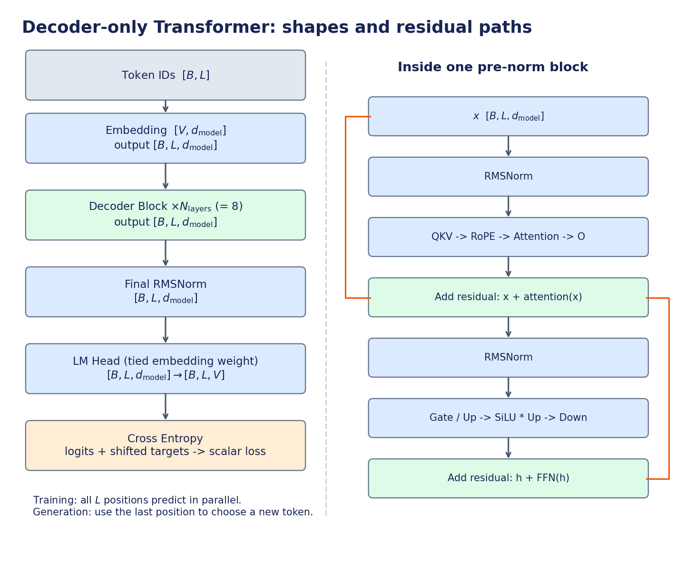

# Tiny Transformer Lab

面向 **A100 80GB PCIe + `nvcr.io/nvidia/pytorch:25.08-py3`** 的单卡训练与推理学习项目。
完整 PyTorch 参考框架已经提供；student embedding 已接入 CUDA FP32 前向与一阶反向，RMSNorm 已接入 FP32 前向与一阶反向，其余学生算子待实现。



## 从这里开始

1. 阅读 [Transformer 算法手册](docs/transformer.md)：从 next-token prediction 到反向传播与 KV Cache。
2. 阅读 [开发与优化手册](docs/development.md)：算子契约、CuTe 任务、测试和测量边界。
3. 阅读 [八种 Student 算子开发契约](docs/operators/README.md)：逐项查看真实输入输出、精度、布局和功能边界。
4. 跑通下面的 smoke 流程，再逐个启用 `student` 算子。
5. 查看 [当前验证记录](docs/validation.md)，区分本地已验证与 A100 待验证内容。

**服务器不能联网时，使用 [离线部署指南](docs/offline.md)。** 本机已准备真实 TinyStories 子集、
8K BPE、编码后的 train/val 和 Linux tokenizer wheel；离线包同时包含项目代码与校验文件。

## 环境

在 GPU 主机的项目根目录执行。宿主机需要 NVIDIA 驱动、Docker 和 NVIDIA Container Toolkit；
驱动兼容性以 NVIDIA 对该镜像的 release notes 为准。容器不提供宿主机驱动。

```bash
docker run --rm -it --gpus all --ipc=host \
  --ulimit memlock=-1 --ulimit stack=67108864 \
  -v "$PWD":/workspace/tiny-transformer \
  -w /workspace/tiny-transformer \
  nvcr.io/nvidia/pytorch:25.08-py3 bash

# 以下命令在容器内执行；保留镜像原有的 torch/CUDA。
python -m pip install -e '.[data]'
python -c 'import torch; print(torch.__version__, torch.version.cuda); print(torch.cuda.get_device_name())'
export TORCH_CUDA_ARCH_LIST=8.0
```

也可用仓库 Dockerfile 构建已安装数据依赖的派生镜像：

```bash
docker build -t tiny-transformer:25.08 .
docker run --rm -it --gpus all --ipc=host \
  -v "$PWD":/workspace/tiny-transformer tiny-transformer:25.08
```

项目不在 pip dependencies 中声明 torch，以防覆盖 NGC 中预装的 CUDA wheel。
运行前必须已经安装 PyTorch。Python 3.9+；CPU 验证环境为 PyTorch 2.8.0。

## 第一次跑通：不需要下载数据

```bash
# 自动创建独立输出目录；使用 CPU 小模型，包含测试、训练、生成、benchmark、profile。
bash scripts/smoke.sh

# GPU 容器内的验收：FP32 / BF16 / FP16、SDPA、compile、profile。
bash scripts/a100_validate.sh
```

当前工作区已有 `data/smoke`：500 条训练、50 条验证合成故事，byte tokenizer。
它只验证流水线，不用于证明模型质量或报告 60M 模型吞吐。
`data/` 与 `runs/` 不纳入版本控制，换机器后通过脚本重建。

## 真实数据：TinyStories + 8K BPE

```bash
python -m tiny_transformer.prepare \
  --source tinystories --output data/tinystories-8k \
  --train-docs 100000 --val-docs 2000 \
  --tokenizer-docs 20000 --vocab-size 8192
```

脚本解析并记录数据集实际 revision，只在 train split 上训练 tokenizer，分开生成 train/val
token 文件，记录文本、token 文件和 tokenizer 的 SHA256。目标目录已存在时拒绝覆盖。
首次下载需要能访问 Hugging Face。本机已通过系统代理完成下载与打包：
过滤空文本后为 99,983 篇训练故事（21,729,332 tokens）和 2,000 篇验证故事（385,234 tokens）。
已存在的数据目录无需再次运行 prepare；输出目录存在时脚本会拒绝覆盖。
使用前阅读数据集卡片和使用条款。

没有外网的 GPU 主机可以在联网机器执行上述步骤，再复制整个 `data/tinystories-8k` 目录。
也支持自备 JSONL（每行 `{"text":"..."}`）：

```bash
python -m tiny_transformer.prepare --source local \
  --train-jsonl /path/to/train.jsonl --val-jsonl /path/to/val.jsonl \
  --output data/local-8k --vocab-size 8192
```

## 60M 训练

```bash
# 算法参考基线，默认 eager attention。约 62.93M 参数。
python -m tiny_transformer.train --config configs/model_60m.json \
  --data data/tinystories-8k --output runs/60m-eager --device cuda

# 成熟库性能基线：相同配置，单独启用 SDPA。
python -m tiny_transformer.train --config configs/model_60m.json \
  --data data/tinystories-8k --output runs/60m-sdpa --device cuda \
  --op attention=sdpa

# FP32 对照：保持同一数据、seed、batch、seq_len；默认关闭 TF32。
python -m tiny_transformer.train --config configs/model_60m.json \
  --data data/tinystories-8k --output runs/60m-fp32 --device cuda --precision fp32

# 保持训练总 schedule 为 1000 steps，只执行前 20 steps。
python -m tiny_transformer.train --config configs/model_60m.json \
  --data data/tinystories-8k --output runs/resume-demo --device cuda --stop-after 20
python -m tiny_transformer.train --config configs/model_60m.json \
  --data data/tinystories-8k --output runs/resume-demo --device cuda \
  --resume runs/resume-demo/last.pt
```

默认每步处理 `8 × 512 × 4 = 16384` 个 input tokens；1000 steps 约 16.38M tokens。
采样是可复现的随机 token 窗口、有放回抽样；step 不等于 epoch。
100M tokens 可设置 `--steps 6104`。正式长训前先跑 100–200 步实测速度和显存。

日志：`metadata.json`、逐步 `metrics.jsonl`、原子写入的 `last.pt`。
训练含验证、梯度裁剪、AdamW、warmup/cosine、FP16 GradScaler 与 RNG/sampler 恢复。
只加载自己信任的 checkpoint；当前 checkpoint 含 optimizer 和 RNG 的 Python 对象。

## 推理、benchmark 与热点

```bash
python -m tiny_transformer.generate --checkpoint runs/60m-sdpa/last.pt \
  --device cuda --precision bf16 --prompt "Once upon a time" --max-new-tokens 128

python -m tiny_transformer.benchmarks.model --checkpoint runs/60m-sdpa/last.pt \
  --device cuda --precision bf16 --batch-size 1 --prompt-length 512 \
  --new-tokens 128 --repeats 10 --output runs/bench-b1.json

TORCH_LOGS="graph_breaks,recompiles" python -m tiny_transformer.benchmarks.model \
  --checkpoint runs/60m-sdpa/last.pt --device cuda --precision bf16 --compile \
  --prompt-length 512 --new-tokens 128 --output runs/bench-compile.json \
  2> runs/compile.log

python -m tiny_transformer.profile --checkpoint runs/60m-sdpa/last.pt \
  --device cuda --precision bf16 --phase decode --seq-len 512 --output runs/profile-decode
```

`--phase train/prefill/decode` 分别分析三类负载。生成 Chrome/Perfetto trace、算子时间表和前三个热点。
benchmark 报告冷请求、稳态 TTFT/TPOT、输出 token 吞吐、allocated/reserved 峰值显存、环境和原始 trial。
它是固定 batch 的模型基准，不是 HTTP 服务或动态调度器。

## 实现你的第一个算子

已有 embedding 的一 warp 一 ID 前向和 warp 内分组累加反向，支持 CUDA 连续 int64 IDs 与 FP32 weight，
首次调用延迟编译扩展。构建依赖、检查与推理命令见 [csrc 说明](csrc/README.md)。
已通过 eager autograd 接入一阶梯度；GPU 编译、数值及性能需在目标 CUDA 环境验收。
它尚不支持二阶梯度、低精度 weight 或 torch.compile。

修改 `tiny_transformer/operators/student.py` 对应函数，在 `csrc/` 添加实际代码。
RMSNorm 当前支持 CUDA FP32 前向与一阶反向（反向 H <= 1024），非连续输入由 Python 入口显式复制。
[代码检查与 PyTorch 接入步骤](docs/operators/rms_norm.md#7-前向缓存与-pytorch-调用链) 包含各层职责和测试说明。
例如只替换 RMSNorm：

```bash
python -m tiny_transformer.check_ops --operator rms_norm --backend student \
  --device cuda --precision fp32 --output runs/rmsnorm-check.json

python -m tiny_transformer.benchmarks.model --checkpoint runs/60m-sdpa/last.pt \
  --device cuda --precision fp32 --op rms_norm=student --output runs/rmsnorm-e2e.json
```

未实现的算子会明确抛出 `NotImplementedError`；已接入算子的范围外调用会报错。没有自动退回 PyTorch 的隐藏路径。
训练接入必须支持正确反向；仅完成前向时先用于 inference。

## 正确性测试

测试职责与精简说明见 [tests/README.md](tests/README.md)。日常使用一个回归入口：

```bash
python -m unittest discover -s tests -v
# 只验证 embedding、RMSNorm 及它们的模型接入：
python -m unittest discover -s tests -p 'test_student_*.py' -v
```

两个算子文件只维护 kernel 与 autograd 的核心回归；模型训练、prefill/decode 放在
`test_student_integration.py` 共用。性能测量使用下面的 benchmarks 命令。

## 统一算子性能测试

八个算子的性能代码集中在 [tiny_transformer/benchmarks](tiny_transformer/benchmarks/README.md)，
统一采用校验后预热、CUDA events、交替后端顺序、多轮中位数；forward/backward 分开计时。
保留 embedding 的四种 ID 分布与 grouped/baseline，对所有算子记录形状、stride、原始样本和跳过原因。

```bash
python -m tiny_transformer.benchmarks --operator rms_norm \
  --layouts contiguous strided last-only --phases forward backward --output runs/rmsnorm-performance.json
python -m tiny_transformer.benchmarks --operator embedding \
  --backward-impl all --output runs/embedding-performance.json
python -m tiny_transformer.benchmarks --operator all --output runs/all-operators-performance.json
```

当前 student RMSNorm 可测 FP32 前向与一阶反向（H <= 1024）；未实现的算子、反向或低精度阶段在报告中明确跳过。
`--backend reference` 可验证八个算子的测量流程，`--operator attention --backend sdpa` 可比较 SDPA。
模型端到端入口为 `python -m tiny_transformer.benchmarks.model`；旧命令保留转发兼容。

## 目录

```text
configs/                    小模型与 60M 模型 JSON 配置
tiny_transformer/
  operators/reference.py    可执行算法规范
  operators/student.py      你需要实现的算子入口
  operators/dispatch.py     逐算子选择后端
  model.py                  decoder、参数管理、连续 KV cache
  tokenizer.py / prepare.py tokenizer、下载与 token 文件生成
  data.py                   packed window、文档边界与标签
  train.py / generate.py    训练、续训、文本生成
  benchmark.py / profile.py 性能测量与热点分析
  check_ops.py              小形状算子数值/梯度检查
  benchmarks/               集中的算子性能与整模型性能测试
csrc/                       你的 CUDA / CuTe / CUTLASS 实现
tests/                      算法、数据、缓存、梯度、续训测试
scripts/                    CPU/GPU 验收、图表重建
docs/transformer.md          算法手册
docs/development.md          工程与优化手册
```

当前未实现：embedding 二阶梯度、RMSNorm 二阶梯度与低精度路径、其余学生 GPU kernel、paged attention、CUDA Graph bucket、量化、分布式训练、HTTP serving。
这些是后续实验，不会被标记为已完成优化。
