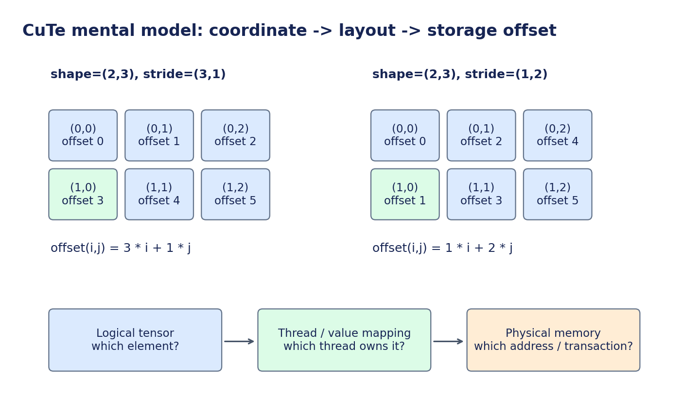

# 开发与优化手册：用 CuTe/CUDA 把算子接进真实训推系统

这份文档定义你的工作范围、实现契约、学习顺序、验证方法和性能实验。
先阅读 [算法手册](transformer.md) 的前向主线。环境与可复制命令见 [README](../README.md)。

## 1. 框架已提供什么，你需要完成什么

| 已提供并可运行的参考路径 | 你逐步完成的部分 |
|---|---|
| 模型参数、block 编排、autograd 训练 | CUDA / CuTe / CUTLASS 前向算子 |
| tokenizer、数据准备、packed windows | 自定义算子的 backward 与集成 |
| FP32/BF16/FP16 训练、验证、checkpoint | 实际 shape 调优、误差与性能回归 |
| prefill、连续 KV cache、greedy/sampling | 融合、布局、减少 launch 和中间流量 |
| eager attention / SDPA 两种基线 | 后续 tiled attention、Graph、量化实验 |
| benchmark、Profiler、CPU/GPU 测试入口 | A100 上的真实实验结果和瓶颈解释 |

`operators/reference.py` 是可执行规范，不是要求你提交的优化实现。
`operators/student.py` 已接入 embedding 的 CUDA FP32 连续输入前向与一阶反向，其余入口保留为
`NotImplementedError`，没有隐藏 reference fallback。embedding 使用 eager autograd 连接反向，
GPU 编译、数值和性能仍需在目标环境验收；尚未接入二阶梯度和 torch.compile。
你可以只实现其中一个，通过 `--op rms_norm=student` 启用，其余继续使用参考路径。

开始实现前，阅读 [Student 算子总契约与八份逐算子文档](operators/README.md)。
其中逐项列出了实际训练/推理输入、dtype、stride、反向返回项，以及完整兼容与首版支持范围的区别。

当前范围是单 GPU、固定 batch、普通 MHA。没有请求调度器、HTTP 服务、多卡训练、paged attention、
CUDA Graph bucket 或权重量化。它们是后续里程碑，不应出现在当前的“已完成”列表中。

## 2. 建议的学习与开发顺序

| 阶段 | 任务 | 交付物 | 通过标准 |
|---|---|---|---|
| A | 理解 reference model；跑 CPU smoke 与 A100 验收 | baseline 日志 | causal/cache/梯度/续训测试通过 |
| B | CuTe Layout、tile、线程分工小练习 | 索引打印、复制/转置实验 | 手算地址与运行结果一致 |
| C | RoPE 或 SwiGLU 前向 | 第一个 CuTe/CUDA kernel | 多 shape、非连续输入、dtype 对齐 |
| D | RMSNorm 前向及反向 | reduction kernel | gradcheck、小训练回归通过 |
| E | CUTLASS Linear 三种 GEMM | forward/dX/dW | 真实层 shape 与 cublas/cuBLASLt 对照 |
| F | 融合与编译 | residual+norm 或 gate/up 融合实验 | 算子及端到端结果、失败点解释 |
| G | Attention 与推理管理 | tiled attention / Graph 等 | 多 context 与 batch 正确且有证据 |

你已有 CUDA 和 CUTLASS 基础，可以在 C/D 与 E 之间调整顺序。
第一周目标是 A+B+C 与一个真实模型实验；全面掌握后续内容需要更长周期。
每完成一个阶段写下“原先假设、测量结果、如何解释”，不要只保留最快一次。

## 3. CuTe C++：重点掌握的数据映射



CuTe C++ 是用于描述张量布局、分块和线程/数据映射的工具，和 CuTe DSL 不是同一个入口。
本项目学习重点是 C++；不依赖 DSL。A100 对应 SM80，优先选 Ampere 的官方示例。

### 3.1 Layout 是坐标到 offset 的函数

逻辑 shape $(2,3)$，stride $(3,1)$：$\operatorname{offset}(i,j)=3i+j$。
同样 shape、stride $(1,2)$：$\operatorname{offset}(i,j)=i+2j$。
同一坐标 $(1,0)$ 分别对应 offset 3 和 1。

最小 C++ 主机练习可以从下面开始；这是布局练习，不是 GPU kernel：

```cpp
#include <cute/tensor.hpp>
using namespace cute;

auto row_major = make_layout(make_shape(Int<2>{}, Int<3>{}),
                             make_stride(Int<3>{}, Int<1>{}));
auto col_major = make_layout(make_shape(Int<2>{}, Int<3>{}),
                             make_stride(Int<1>{}, Int<2>{}));
// 打印 row_major(make_coord(1, 0)) 与 col_major(make_coord(1, 0))。
// 遍历全部坐标，手算并验证 offset。再尝试含动态维度的 layout。
```

需要理解：

- `Shape` 描述各 mode 的大小，mode 可以嵌套，不一定是平坦维度列表。
- `Stride` 描述每个 mode 对 offset 的贡献。
- `Layout` 组合 shape 与 stride；composition/partition 是映射的变换。
- `Tensor` 把数据来源/存储与 layout 结合起来，tensor view 本身不自动搬数据。
- layout 的逻辑元素数与存储跨度可以不同：带 padding/stride 的张量会出现空洞。

### 3.2 Tile 与线程分工

学习 `local_tile` 等操作时，分别写出四件事：

```text
整个问题：全局 tensor 的 logical shape / stride
CTA tile：当前 block 负责的逻辑范围
thread partition：当前线程负责哪些元素
physical access：这些元素对应哪些 global/shared 地址
```

Coalescing 取决于同一个 warp 在一条 load/store 指令中访问的地址，不能仅由逻辑 shape 判断。
向量化要求地址对齐、连续元素与合法边界。tile 超过问题边界时要 predication，不能仅屏蔽 store 而让 load 越界。

建议自己完成三个小实验：

1. 复制 $37\times65$ 矩阵，故意使用不整除 tile 的尺寸，验证尾部处理。
2. 输入带 padding stride，输出连续，验证 `size` 与存储跨度的区别。
3. 转置矩阵，通过 shared memory 改善访存，记录 bank conflict 与带宽变化。

这些练习独立于模型，但最终要把同样的布局能力用在 QKV view、RoPE、KV cache 的真实 stride 上。

### 3.3 TiledCopy / TiledMMA

在第一个 GEMM 中，先回答“哪个线程把哪个 A/B 元素从哪里搬到哪里”，再回答“哪个线程持有哪些 accumulator”。
`Copy_Atom` / `TiledCopy` 组织复制；`MMA_Atom` / `TiledMMA` 组织硬件计算及线程值映射。
具体类型名和可用实例以你固定的 CUTLASS commit 为准。

SM80 的进一步主题包括 `cp.async`、shared-memory staging、`mma.sync`、双缓冲/多 stage、bank-conflict 避免。
TMA/WGMMA 不属于本项目 A100 的实现路线。

建议先读能编译运行的 Ampere CuTe GEMM 示例，再打印它的 layout 与 partition，最后修改 tile。
不要从性能最复杂的 pipeline 开始逆向理解所有模板参数。

## 4. 算子契约：先兼容，再优化

符号沿用[算法手册](transformer.md#0-阅读路线和符号)：$B$ 为 batch size，$L$ 为序列长度，
$d_{\mathrm{model}}$ 为模型维度，$H$ 为头数，$d_h$ 为单头维度，$d_{\mathrm{ffn}}$ 为 FFN 中间维度。
$L_q$、$L_k$ 分别为 query 和 key 的序列长度。

统一规则：输出留在输入 device；不得偷偷搬到 CPU；不得在 kernel 内或 wrapper 中加入全设备同步；
默认不修改输入；遵守 reference 的 dtype、广播、数学约定和反向语义。
如果只支持某些 shape/stride，应明确检查并报错，性能实验应声明支持范围。

| 入口 | 输入和输出 | 特别注意 |
|---|---|---|
| `embedding(ids, weight)` | ids 的形状为 $[B,L]$、dtype 为 int64；weight 的形状为 $[V,d_{\mathrm{model}}]$；输出为 $[B,L,d_{\mathrm{model}}]$ | 重复 token 的梯度累加 |
| `linear(x, weight)` | x 的形状为 $[\ldots,K]$，weight 为 $[N,K]$，输出为 $[\ldots,N]$ | 权重按 `[out,in]`，无 bias；autocast |
| `rms_norm(x,w,eps)` | x 的形状为 $[\ldots,d_{\mathrm{model}}]$，w 为 $[d_{\mathrm{model}}]$；输出与 x 的 shape/dtype 相同 | FP32 累加、$\epsilon$、跨行 $d\gamma$ |
| `rope(x,cos,sin)` | x 的形状为 $[B,H,L,d_h]$；cos/sin 为 $[B,1,L,d_h/2]$ 或 $[1,1,L,d_h/2]$ | adjacent pairs、非连续 Q/K |
| `attention(q,k,v,past_len,segments)` | q 的形状为 $[B,H,L_q,d_h]$，k/v 为 $[B,H,L_k,d_h]$；输出与 q 的 shape 相同 | 非方形 causal mask；缓存视图 stride |
| `swiglu(gate,up)` | 两个 $[\ldots,d_{\mathrm{ffn}}]$ 张量，输出形状相同 | gate/up 来自合并输出的切片 |
| `residual(x,update)` | 同 shape → 和 | dtype promotion；避免破坏 residual |
| `cross_entropy(logits,targets)` | logits 的形状为 $[B,L,V]$，targets 为 $[B,L]$，输出为标量 | FP32 loss、`-100`、有效 token 平均 |

初期保留 embedding、residual、cross_entropy 为参考实现即可。它们提供扩展点，
不意味着必须把每个入口都重写才算完成项目。

### 4.1 dtype 不是一个全局常量

训练参数保留 FP32，autocast 根据算子选择计算精度；norm、残差、GEMM 的输入/输出可能混合。
原生 `F.linear` 有 autocast 规则，自定义 pybind CUDA 扩展不一定自动继承。
必须明确注册 autocast 处理或在 wrapper 中遵守所选精度，并验证 FP32 参数梯度正确回传。
不能将 FP32 权重指针误按 BF16 解读。

建议先实现 FP32 inference，对齐语义；再做 BF16 inference；最后处理 AMP training 与 backward。
一个前向成功运行的 kernel，并不因此支持训练。

### 4.2 Stride 与 alias

实际会遇到：

- Q/K/V 的 transpose 视图，通常非连续。
- gate/up 的 chunk，行 stride 可能大于自身宽度。
- KV 前缀视图 `cache[:, :, :length, :]` 的形状为 $[B,H,\ell,d_h]$，其中 $\ell=\mathrm{length}$；head stride 仍然按 capacity 而非 length 计算。
- weight 的转置逻辑与实际 $[N,K]$ 存储。

最初可以显式做 `.contiguous()` 保证正确，但必须把复制时间和分配成本纳入端到端测量。
最终学习目标是理解并直接消费必要的 stride，而不是把复制成本隐藏在 benchmark 外。

### 4.3 PyTorch / CUDA 扩展的工程要求

1. 使用正确 device guard，支持张量所在设备。
2. 在 PyTorch **current CUDA stream** 上发射 kernel，不能硬编码默认 stream。
3. 检查 device、dtype、shape、stride、对齐和参数合法性。
4. 使用 PyTorch allocator 管理 tensor/workspace 生命周期，不缓存悬空指针。
5. 做 kernel launch error 检查；不要用 device synchronize 掩盖 stream race。
6. 在 `student.py` 中延迟加载扩展，避免仅 import 模型就编译所有代码。
7. 固定 CUTLASS commit、编译器、nvcc flags；记录 `TORCH_CUDA_ARCH_LIST=8.0`。

迭代期可使用 `torch.utils.cpp_extension.load`，指定源文件与 CUTLASS include 目录。
默认保持编译缓存，不把 JIT 编译时间算入稳态 kernel 时延。

### 4.4 Autograd 与 torch.compile

eager 阶段可以用 `torch.autograd.Function` 明确 forward/backward。
要支持 compile，应采用相应 PyTorch 版本支持的自定义算子注册方式，声明 mutation/alias，
提供 FakeTensor/meta 形状推导，并注册 autograd。

需要分别测试：eager forward、eager backward、compile forward、compile backward。
Python wrapper 没报错，不意味着编译器能看见 kernel 的数学内容，也不意味着它能与邻近算子融合。
通常自定义外部算子会作为独立调用保留，收益要与 Inductor 本来可做的融合对照。
可使用 `torch.library.opcheck` 验证注册契约；它不替代数值/梯度对照。

## 5. 逐算子的优化问题与实验

### 5.1 RMSNorm / residual + RMSNorm

工作量大致为每行 $O(d_{\mathrm{model}})$，通常是带宽/归约/launch 问题。
探索每行一个 warp 或多个 warp、向量 load、FP32 accumulation、减少同步与寄存器压力。

融合目标：将 $h=x+\mathrm{update}$ 与后续 $\operatorname{RMSNorm}(h)$ 合并，减少中间张量的写回与重读。
注意 block 的 residual stream 还需要 $h$，因此融合入口通常需要同时返回 $h$ 和归一化后的 $h$。
现有独立 `residual` / `rms_norm` 接口没有假装实现这种跨算子融合；到该阶段再显式增加 fused API 和 reference。

验证：$d_{\mathrm{model}}\in\{64,65,128,768,1024\}$，$M\in\{1,2,128,4096\}$，零输入、大幅值、不同 dtype、非连续输入。
反向还要验证 $d\gamma$ 的跨行 reduction。仅减少 kernel 数而额外保存多个大张量，可能抵消带宽收益。

### 5.2 RoPE

每对元素只涉及少量计算。优化点是向量化访问、coalescing、避免多次读取相同 sin/cos、减少 launch。
cos/sin 的生成也属于模型成本，本参考路径每次构造相位；可把预计算表或融合生成作为单独实验。
务必保留 FP32 相位精度，并测量表读取与直接计算的取舍。

进阶实验是将 $\operatorname{RoPE}(K)$ 与 cache write 融合：减少旋转结果落地再复制的流量。
这会引入原位写入与 cache mutation，需要新的 API 契约、边界检查和 compile 兼容处理。
Q 不写入 KV cache，K 不应被重复旋转。

### 5.3 SwiGLU

先把 SiLU 和乘法融合为一个 pointwise kernel，再考虑与 gate/up GEMM 的 epilogue 融合。
gate 和 up 存储在合并输出的两段；跨段配对是否容易被 epilogue 支持取决于具体 CUTLASS 路径。
不要假设任何 epilogue 都能无成本读取另一半 tile。

### 5.4 CUTLASS GEMM

默认训练 $B=8,\ L=512$ 时的主要前向 GEMM：

| 层 | $M$ | $N$ | $K$ |
|---|---:|---:|---:|
| QKV | 4096 | 2304 | 768 |
| Attention O | 4096 | 768 | 768 |
| Gate/Up | 4096 | 4096 | 768 |
| Down | 4096 | 768 | 2048 |
| LM head | 4096 | 8192 | 768 |

decode 中 $M$ 变成 batch size，其他维度不变；本项目 inference 只对最后一个位置做最终 norm/LM head。
比较时双方必须采用相同的 last-only 策略。

记录 CTA tile、warp tile、stage、数据布局、alignment、workspace、split-K、accumulator dtype。
较大与较小的 $M$ 分别调优；split-K 可能改善较小 $M$ 的并行度，也增加归约成本并改变数值累加顺序。
先比较实际层 shape，再决定是否需要 shape dispatch。

记耗时为 $t$，单位为秒，则吞吐计算为：

$$
\mathrm{Throughput}_{\mathrm{TFLOP/s}}=\frac{2MNK}{t\times10^{12}}.
$$

比较 BF16 dense GEMM 时用对应 dtype 的 dense Tensor Core 峰值，不使用稀疏峰值。
FP32 需明确 TF32 状态；cuBLAS 与 cuBLASLt 的不同算法选择也应记录。

### 5.5 Softmax / Attention

先独立实现稳定 row softmax，学习归约和掩码，再尝试 tiled attention。
将旧 tile 的 softmax 统计 $(m,l,o)$ 与新 tile 合并时，可以维护未归一化输出累加器：

$$
m'=\max(m,m_{\mathrm{tile}})
$$

$$
l'=e^{m-m'}l+\sum_j e^{s_j-m'}
$$

$$
o'=e^{m-m'}o+\sum_j e^{s_j-m'}v_j
$$

全部 key tiles 处理完后输出 $\frac{o}{l}$。累加与缩放的精度、mask、部分 tile 和初始化要明确。
这个公式说明可以跨 tile 精确合并归一化统计量，但浮点舍入仍与朴素实现不同。

高效训练反向涉及重计算、并行归约和更多调度问题，应作为独立阶段。
已有 SDPA 提供强基线：自写 attention 的目的既包括理解，也包括判断何时成熟库已足够好。

## 6. 数据与训练的工程流程

`prepare.py` 支持 synthetic smoke、TinyStories streaming 和本地 JSONL。
下载时先物化选定 train/val 文本，BPE 只读取 train 文本，再将各 split 编码为定长 dtype 的二进制 token 流。
prepare 在临时目录完成后原子重命名，失败时清理未完成目录，不覆盖已有数据。

目录格式：

```text
metadata.json    source revision、split token 数、dtype、SHA256
tokenizer.json   byte 描述或 BPE 的完整序列化定义
train.bin       little-endian uint16/uint32 token IDs
val.bin
```

文档截取默认从固定 split 的前 N 篇开始，适用于可复现的小实验；它不是随机代表性抽样。
`--keep-text` 可保留原始 JSONL 便于审查。对 local source，用户负责确保两份文件没有训练/验证泄漏。

dataset 用 memory map + 随机窗口，不预先构建巨大的 batch 数组。
当前 CPU→GPU 复制路径保持简单；若 profile 显示数据加载/搬运影响吞吐，再添加 pin memory、prefetch 或独立 copy stream。
这些改动需要事件同步，避免消费尚未完成的数据。

训练默认参数是 FP32，Adam 一二阶状态通常也是 FP32，梯度也会占用显存。
约 $16\times\text{参数量}$ 字节可粗估参数、梯度与两份矩状态，仍需另加激活、logits、workspace 和 allocator 预留。
默认 vocab projection 在长序列时也可能成为显存热点。

checkpoint 保存模型、optimizer、scaler、step、Python/NumPy/Torch/CUDA RNG、采样器状态、tokenizer、data manifest。
恢复要求模型/数据/训练语义一致。允许修改总 steps 以延长训练，但这会改变后续 cosine schedule，
不能声称与一开始就设置更长 steps 的训练完全等价。精确恢复实验应保持总 steps 不变，用 `--stop-after` 中断。

当前没有 dropout 与异步 dataloader，简化了复现；GPU 上仍可能因非确定性 kernel 有微小差异。
记录 seed 不等于保证所有平台 bitwise 一致。

## 7. 测试金字塔：每次替换算子如何验收

```text
完整模型短程训练 / loss 回归 / 缓存解码
                 ↑
     自定义算子 forward + backward 对照
                 ↑
   小矩阵手算 / layout 地址 / 边界与 stride
```

### 7.1 已有测试

```bash
python -m unittest discover -s tests -v
```

测试包含 RMSNorm/RoPE/SwiGLU 的 double gradcheck、SDPA 前向与反向对照、未来 token 不泄漏、
隔离文档不泄漏、缓存 chunk/逐 token/重置、固定 batch 可过拟合、tokenizer Unicode roundtrip、
数据 hash 复现、标签偏移、未实现 student 明确失败、精确断点续训、CUDA BF16 缓存测试。
CPU 环境只跳过 GPU 专属项。compile 单元测试使用 eager backend 验证图捕获语义，不代表已经验证 Inductor/CUDA 性能。

### 7.2 学生算子开发工具

```bash
python -m tiny_transformer.check_ops --operator rope --backend student \
  --device cuda --precision fp32 --backward --output runs/rope-fp32.json
python -m tiny_transformer.check_ops --operator rope --backend student \
  --device cuda --precision bf16 --backward --output runs/rope-bf16.json
```

工具自带 prefill/decode 小尺寸、奇数尾部或 stride 场景，输出最大绝对误差和微基准。
它是入口测试，不是覆盖全部 shape 的认证；实现真实 kernel 后需要扩展 `check_ops.py::cases` 或加入专属测试。
仅前向实现先省略 `--backward`，通过后可跑 inference；不能直接接训练。

误差同时看最大绝对误差、相对误差分布、相对 $L_2$ 误差；对接近零的 reference，相对误差会被放大。
工具提供的 dtype tolerance 是起始标准，不是所有算子的通用正确阈值。
若失败，应定位 reduction 顺序、精度、mask、越界与 stride；不能仅扩大 tolerance 让测试通过。

还应补充：

- $B\in\{1,2,8\}$，$L\in\{1,17,128,512,2048\}$，$d_{\mathrm{model}}\in\{64,65,768\}$ 等实际与尾部形状。
- 输入包含零、较大值、负值，RoPE 包含较大 position。
- attention 的 $L_q=1,\ L_k>1$ 和 $L_q>1,\ L_k>L_q$。
- 连续/非连续输入，不同 CUDA stream，重复调用与 cache reset。
- FP32/BF16/FP16，autocast 与 FP32 master 参数组合。
- `compute-sanitizer` 下的越界、race、未初始化数据读取。

gradcheck 依赖 FP64 数值差分；只实现低精度的 kernel 应先与可微 reference 的解析梯度对照。
低精度下 loss 不应要求逐步 bitwise 一致，但短程训练趋势和验证质量要合理。

## 8. 正确 benchmark：先定义边界

### 8.1 训练

`train.py` 的每步计时包含：采样、CPU→GPU copy、所有 microbatch 的前向/反向、裁剪和 optimizer。
CUDA 在边界同步；eval、checkpoint 和日志写入在计时之外。
最初两步标记 `measurement_warmup`；compile/长 pipeline 可能需要更多预热，应根据数据剔除尚未稳定的步骤。

`tokens_per_second` 的分子为输入 token 数；隔离模式另记 `valid_target_tokens`，不能混淆两个吞吐定义。
峰值显存统计自 reset 后的整个训练过程，后续 evaluation 也可能影响高水位。
需要纯训练峰值时单独控制 eval 并记录对应区间，不应把不同边界的数据放在同一列。

### 8.2 推理

`benchmark.py` 使用固定 batch、GPU 常驻 synthetic prompt、固定输出长度、greedy argmax。
不提前遇 EOS 停止，以确保不同实现工作量一致。模型可以用随机权重做性能实验，但质量结论必须使用训练 checkpoint。

记每条序列的生成 token 数为 $G$，prefill 至首 token 的耗时为 $t_{\mathrm{prefill}}$，
首 token 后的 decode 耗时为 $t_{\mathrm{decode}}$，总请求耗时为
$t_{\mathrm{request}}=t_{\mathrm{prefill}}+t_{\mathrm{decode}}$；这些耗时的数值均以秒计，且 $G\ge2$。

| 指标 | 本项目定义 |
|---|---|
| TTFT（ms） | $\mathrm{TTFT}_{\mathrm{ms}}=10^3t_{\mathrm{prefill}}$；host 同步计时，包含新 cache 分配、prefill、第一次 argmax，prompt 已在 device |
| TPOT（ms） | $\mathrm{TPOT}_{\mathrm{ms}}=\frac{10^3t_{\mathrm{decode}}}{G-1}$ |
| output tokens/s | $\frac{BG}{t_{\mathrm{request}}}$ |
| decode tokens/s | $\frac{B(G-1)}{t_{\mathrm{decode}}}$ |
| 峰值 allocated | PyTorch allocator 实际分配 tensor 的高水位 |
| 峰值 reserved | PyTorch allocator 预留显存的高水位 |

这些显存统计不等于 `nvidia-smi` 整进程显存；扩展自行分配的显存也可能不计入 PyTorch allocator。
CPU 路径的 CUDA 显存字段为 null，绝不伪造为 0GB GPU 测量。

decode 循环不逐 token 做 host synchronize；在整个区间末尾同步，避免人为增加每步等待。
TPOT 的 p95 是不同请求 trial 的平均 TPOT 的 p95，**不是单个 token 延迟分布的 p95**。
输出 JSON 保留每次 trial，不只给最小值。

### 8.3 编译成本与 graph break

```bash
TORCH_LOGS="graph_breaks,recompiles" python -m tiny_transformer.benchmark \
  --config configs/model_60m.json --device cuda --precision bf16 \
  --op attention=sdpa --compile --prompt-length 512 --new-tokens 128 \
  --output runs/compile.json 2> runs/compile.log
```

冷请求包含懒编译、运行库初始化、allocator 预热；它不是纯编译时间。
JSON 另存编译器报告的分项耗时和 Dynamo counters，日志保存图中断与重编译。
编译器指标是版本相关诊断接口，解释时保留原始输出。

本项目 cache 使用 Python length 和随长度增长的 view，这很适合学习正确性，但可能产生新 guard 或重编译。
完整请求预热后仍应检查日志：达到重编译限制并回退 eager 时，不能声称“稳定编译加速”。
固定 bucket、稳定地址和静态形状属于后续优化，不应通过截取最好一次来掩盖动态路径问题。

### 8.4 微基准与模型基准

`check_ops.py` 的时延包含 Python 调用和算子 dispatch，是简单的开发微基准。
对亚微秒 kernel，需要 CUDA events、足够重复次数或受控 CUDA Graph 测量，并明确边界。
不要将纯 kernel event 时间与含 Python 调度的另一条路径直接相除。

每次对比保持硬件、精度、shape、mask、输入/输出长度、权重状态与优化器一致。
TF32 默认关闭；如果启用，两边一致且单独标记。
热身后的测试至少重复 5–10 次，报告中位数及波动。GPU 并发任务、功耗、频率和温度都会影响结果。

## 9. Profiler 与 Roofline：让优化有证据

```bash
python -m tiny_transformer.profile --config configs/model_60m.json \
  --device cuda --precision bf16 --op attention=sdpa \
  --phase train --batch-size 8 --seq-len 512 --output runs/profile-train
python -m tiny_transformer.profile --config configs/model_60m.json \
  --device cuda --precision bf16 --op attention=sdpa \
  --phase prefill --seq-len 512 --output runs/profile-prefill
python -m tiny_transformer.profile --config configs/model_60m.json \
  --device cuda --precision bf16 --op attention=sdpa \
  --phase decode --seq-len 512 --output runs/profile-decode
```

decode profile 预填充一次，然后每次复用同一长度前缀，测量固定 context 的一步计算；
它不包含 token sampling，benchmark 则包含 argmax。train profile 包含 forward/backward/裁剪/optimizer，
使用合成 GPU 常驻数据，其 AdamW 分组是简化路径；最终训练吞吐以 `train.py` 为准。

文件：`trace.json`、`operators.txt`、`summary.json`。
前三热点按 PyTorch operator 的 self device time（CPU 时用 self CPU time）排序，避免把父子总耗时直接重复相加。
同一 operator 的不同 input shape 会分开；它不是 Nsight 的硬件 kernel 排名。

查看时间线时依次问：

1. GPU 在计算还是空闲？CPU dispatch 是否供给不足？
2. 时间在 GEMM、attention、pointwise、copy 还是 optimizer？
3. 是否有意外 `.contiguous()`、dtype conversion、host/device synchronization？
4. 优化后原热点占比降低了吗？新的瓶颈在哪里？

进一步使用 NVIDIA 工具（是否已安装与计数器权限以平台为准）：

```bash
nsys profile -t cuda,nvtx,osrt -o runs/timeline \
  python -m tiny_transformer.benchmark --config configs/model_60m.json \
  --device cuda --precision bf16 --op attention=sdpa --prompt-length 512 --new-tokens 32

ncu --set full --launch-count 10 --target-processes all \
  -o runs/operator-roofline python -m tiny_transformer.check_ops \
  --operator rms_norm --backend student --device cuda --precision bf16 --repeats 10
```

不同 NCU 版本的 section/set 名称可能变化，先查 `ncu --list-sets` 与 `--list-sections`；
用 kernel filter 和 launch skip 选中目标 kernel，避免把初始化 kernel 当成 RMSNorm。
Profiler 本身会扰动执行，profiler 时延不直接替代无 profiler 的 benchmark。

Roofline：

$$
\text{attainable FLOP/s}\le\min(\text{compute peak},\ \text{memory bandwidth}\times\text{arithmetic intensity})
$$

arithmetic intensity 是实际工作与相关内存流量之比。
HBM、L2、shared memory 是不同层级；纸面 load/store 字节数不等于 NCU 测得的 DRAM 流量。
RMSNorm/小 batch decode 常偏带宽或 launch 受限，大 GEMM 更可能接近计算限制，但最终由证据判断。

## 10. 后续优化如何接入

### Paged/block KV

先实现 block allocator、request→block table、分配释放与碎片统计，再让 attention 直接读取分页缓存。
如果每次把分页数据 gather 成连续大张量再调用 SDPA，应明确报告为 gather+SDPA 基线。
要证明分页收益，需要不同请求长度、并发与结束时间的负载；单一固定长度 batch 不足以展示真实碎片管理价值。

### CUDA Graph

固定 batch/context bucket、固定内存地址、预分配 workspace，明确输入/位置/cache 的更新方式。
capture 之前完成编译与分配。捕获一个“始终向同一位置写 cache”的错误图，也可能非常快，因此必须对照逐步 logits。
静态容量 mask 可能增加无效计算；Graph 省下的 launch 成本要与 bucket padding 的开销一起算。

### 权重量化

A100 上区分 W8A8、W8A16 等真实计算路径。
只把权重存为 int8，每次反量化成 BF16 再跑 GEMM，不代表正在利用 INT8 Tensor Core，也不保证加速。
记录权重/scale 格式、group size、校准数据、算子后端、验证 loss 和生成变化。
训练主线稳定后再实验，避免同时引入数值、布局、kernel 三类问题。

## 11. 推荐实验矩阵与记录模板

先固定主配置，每次只改变一项，再做必要的组合，不必第一周跑完全笛卡尔积。

| 变量 | 取值 | 必记指标 |
|---|---|---|
| Precision | FP32/FP16/BF16；另列 TF32 | loss、训练 tokens/s、显存 |
| Sequence | 128/512/1024/2048/4096 | train/prefill 分别测；OOM 也记录 |
| Batch | 1/2/4/8/更大可行值 | TTFT、TPOT、输出吞吐、显存 |
| Attention | eager/SDPA/student | 后端证据、时延、mask 语义 |
| Compile | eager/compile | 冷请求、编译分项、重编译、稳态 |
| Fusion | 单算子/融合 | kernel 时间、DRAM 流量、端到端 |
| KV | contiguous/将来的 paged | 请求负载、碎片、TPOT、管理成本 |

每组结果至少保留：

```text
硬件：A100 80GB PCIe，驱动，GPU 时钟/功耗条件
软件：NGC 镜像标签及 digest，torch/CUDA/nvcc，CUTLASS commit，项目 revision
输入：模型配置，batch，prompt/context，new_tokens，dtype，packing
比较：参考后端，候选后端，变化项，是否包含编译/搬运/分配/采样
正确性：误差，梯度，短程 loss，验证 loss
性能：原始 trials，中位数，波动，allocated/reserved 峰值
解释：前三热点，预期与实测是否一致，瓶颈是否转移，退化形状
复现：完整命令、配置文件、数据 manifest
```

没有普适的“简历合格加速比”。相对合理基线稳定提升 5% 也可能有价值。
根据 Amdahl 定律，若某算子原占比为 $f$，加速 $s$ 倍，则总加速比为：

$$
S_{\mathrm{total}}=\frac{1}{(1-f)+\frac{f}{s}}.
$$

在其他部分耗时不变的前提下，$f=0.05$、$s=2$ 时，有 $S_{\mathrm{total}}\approx1.026$。
测量得到这种结果并能解释，正是从单算子迁移到端到端优化的能力。

## 12. 每周自检与面试准备

完成一个阶段后，尝试不看代码回答：

- 这条算子的输入 shape/stride/dtype 是什么？训练和 decode 有何不同？
- CuTe 中每个线程负责哪些元素？为什么 coalesced？尾部怎样屏蔽？
- 哪些数据留在寄存器/shared，哪些写回 HBM？同步在哪里？
- backward 保存了什么、重算了什么、精度怎样保证？
- 为什么不用成熟库？如果成熟库更快，你能定位原因吗？
- 加速数字包含哪些边界？为何某些 shape 变慢？
- agent 提供的框架中，如果删掉 causal mask 或打乱 position，你能定位失败吗？

框架由工具辅助搭建不妨碍学习；关键是你能够独立解释、修改和验证核心数据流。
本项目留空的 kernel 和逐项契约就是为了保留这一学习空间。

## 资料入口

- [CUTLASS 仓库](https://github.com/NVIDIA/cutlass)
- [CuTe 文档目录](https://github.com/NVIDIA/cutlass/tree/main/media/docs/cpp/cute)
- [CuTe C++ 示例](https://github.com/NVIDIA/cutlass/tree/main/examples/cute)
- [PyTorch custom C++/CUDA operator tutorial](https://docs.pytorch.org/tutorials/advanced/cpp_custom_ops.html)
- [PyTorch AMP](https://docs.pytorch.org/docs/stable/amp.html)
- [NVIDIA PyTorch container release notes](https://docs.nvidia.com/deeplearning/frameworks/pytorch-release-notes/index.html)

这些链接是学习入口；最终实验要锁定实际安装版本。NGC 25.08 的 Python 3.12 已核对官方说明；
CUTLASS/CuTe 的具体模板与 API 仍应以选定源码 commit 为准。
