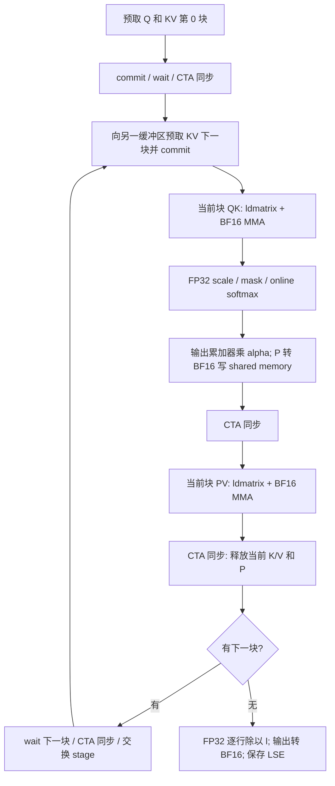

# A100 BF16 Tensor Core attention 前向模板

核心代码：[attention_sm80_bf16_pipeline.cuh](attention_sm80_bf16_pipeline.cuh)。
独立 PyTorch 绑定：[attention_sm80_bf16_binding.cu](attention_sm80_bf16_binding.cu)。
编译与验证：[check_attention_sm80_bf16.py](check_attention_sm80_bf16.py)。

这是用于迁移现有 SIMT 实现的可编译目标模板，不替换生产 `student.attention`。
作者环境没有 CUDA/nvcc，尚未完成 GPU 编译、数值或竞态验收；下面提供完整验收入口。
它采用 Ampere 的 `mma.sync`、`ldmatrix`、`cp.async`，不使用 Hopper 的 TMA/WGMMA。

## 范围与 tile

| 项目 | 配置 |
|---|---|
| Q/K/V/O | BF16，逻辑 `[B,H,T,64]` |
| score、online softmax、输出累加器、LSE | FP32，LSE 为自然对数 |
| CTA | 128 线程，4 个 warp 沿 query 行排列 |
| Query tile BQ | 64 |
| KV tile BK | 64 |
| head_dim | 64，暂不模板分派其他维度 |
| QK CTA GEMM `(M,N,K)` | `(64,64,64)` |
| PV CTA GEMM `(M,N,K)` | `(64,64,64)`；这里 K 是 key token |
| MMA atom | `SM80_16x8x16_F32BF16BF16F32_TN` |
| TiledMMA | `Layout<Shape<_4,_1,_1>>`，基本 tile `(64,8,16)` |
| Gmem → Smem | 16-byte `cp.async.cg`，尾部 token 行 zero-fill |
| K/V 流水线 | 2 级缓冲，共 32 KiB |
| Q 与 P | 各 8 KiB，合计 shared memory 为 48 KiB/CTA |

支持 causal prefill、非方形 chunk/decode 和序列尾块，要求 `Tk=past_len+Tq`。
跳过完全位于 query tile 未来的 KV block，边界 block 仍逐元素 mask。
不支持 dropout、segment IDs、GQA、反向或可训练的输入；decode 可以验证语义，
但 BQ=64 并不是单 query 的高效布局。
独立绑定显式连续化 Q/K/V，并处理连续 view 起点未对齐 16 字节的情况。
原始 kernel 仅接受连续、16-byte 对齐的输入及正维度。

## 一次 KV 迭代的数据流



每轮开始时，当前 stage 已经 ready，另一个 stage 已经不再被上一轮读取。
预取下一块后立即做当前块的计算；`cp_async_wait<0>()` 放在当前块计算结束后。
因此下一块的 global-to-shared 传输可以与当前块的 QK/softmax/PV 重叠，
不是发起异步拷贝后马上等待的串行流程。

这里一个 committed group 包含同一 KV block 的 K 和 V，循环中最多一个 group 未完成。
因此 wait `<0>` 是刻意的选择。若改成同时预取更多块，需要重新推导 wait group 数和尾部排空。
`cp_async_wait` 保证调用线程的异步拷贝完成，不能代替 CTA 的 `__syncthreads()`。
不要删除消费前、释放前和 P 写完后的同步，也不要让 padded query 线程提前 return。

## 与 SIMT 布局不同的地方

MMA 的 C fragment 每线程为 `(4,1,8)`，共 32 个 FP32 score。
对于 warp `w`、lane `l`，atom value `v=0..3` 和 N 重复索引 `n=0..7`：

```text
row = 16*w + floor(l/4) + 8*floor(v/2)
col = 2*(l%4) + (v%2) + 8*n
```

`v=0,1` 属于第一行，`v=2,3` 属于第二行。同一行位于连续的 4 个 lane，
所以 softmax 行归约使用 XOR **1、2**，不能照搬 SIMT 的 XOR 4、8、16。
每个线程维护这两行对应的 `m[2]`、`l[2]`。

QK 的 B 是 K 的 `(key,feature)` 视图，使用非转置 ldmatrix。
PV 的 B 是 V 的 `(feature,key)` 视图，底层仍保存 `(key,feature)`；
采用 `SM75_U16x4_LDSM_T`（`ldmatrix.x2.trans`）按 MMA B fragment 布局装载。
Q/P 的 A operand 使用 `ldmatrix.x4`。

第一版有意将 P 写入 shared memory，再按 PV 的 A fragment 布局读取。
这避免假设 QK 的 C 布局等于 PV 的 A 布局，也消除了原 SIMT 的手写 rS→rE shuffle。
稳定后可以再实现寄存器转换，减少 P 的 shared memory 往返。

## 精度

每个 block 的权重实际是未归一化的 `P=exp(S-m_new)`：

```text
m_new = max(m_old, rowmax(S))
alpha = exp(m_old - m_new)
l_new = alpha * l_old + rowsum(P)
O_acc = alpha * O_acc + BF16(P) @ BF16(V)
O = BF16(O_acc / l)
```

`l` 在 P 转 BF16 之前用 FP32 更新；`m/l/alpha/O_acc` 始终是 FP32。
P 的分块 BF16 舍入与 SDPA/完整 FP64 attention 不逐 bit 一致。
验证脚本同时比较 BF16 SDPA 和 FP64 oracle，独立验证 FP32 LSE；
并包含 Q=K=0、V=1 的精确输出用例，避免只靠宽松容差放过布局错误。

## A100 上编译与验收

在仓库根目录执行，首次运行由 PyTorch JIT 编译模板，要求 CUDA PyTorch、nvcc 和 Ninja：

```bash
TORCH_CUDA_ARCH_LIST=8.0 MAX_JOBS=2 \
python docs/examples/check_attention_sm80_bf16.py --device cuda:1
```

覆盖一个及多个 KV block、stage 循环复用和最后一块排空、query/key 尾块、
cache capacity、跨步及未对齐输入、因果隔离、重复执行，以及非默认 stream。
FP64 和 SDPA 仅用于对照；候选始终调用本模板 kernel，没有 fallback。

```bash
TORCH_CUDA_ARCH_LIST=8.0 compute-sanitizer --tool memcheck --error-exitcode 1 \
  python docs/examples/check_attention_sm80_bf16.py --device cuda:1

TORCH_CUDA_ARCH_LIST=8.0 compute-sanitizer --tool racecheck --error-exitcode 1 \
  python docs/examples/check_attention_sm80_bf16.py --device cuda:1

TORCH_CUDA_ARCH_LIST=8.0 compute-sanitizer --tool synccheck --error-exitcode 1 \
  python docs/examples/check_attention_sm80_bf16.py --device cuda:1
```

编译使用 `--ptxas-options=-v`，留意寄存器数、spill 和 48 KiB shared memory。
用 Nsight Compute/反汇编检查 MMA、LDSM、异步加载指令及实际重叠情况；
完成数值和竞态验收后，再纳入统一 benchmark，与同为 BF16 的 SDPA 比较。
本模板提供的是设计起点，不预设能超过 SDPA。
