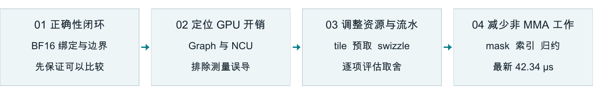
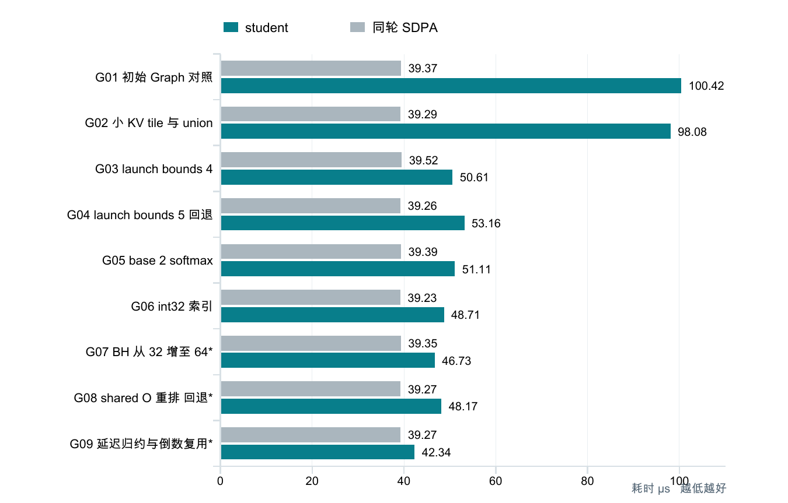
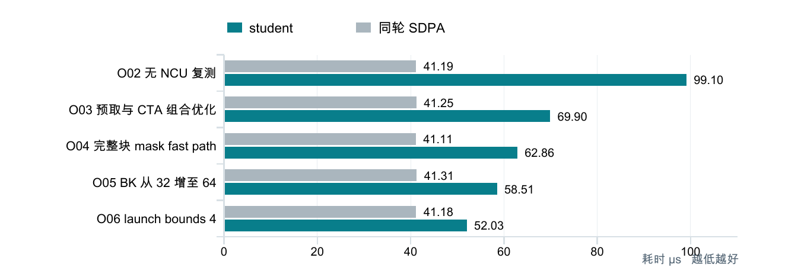
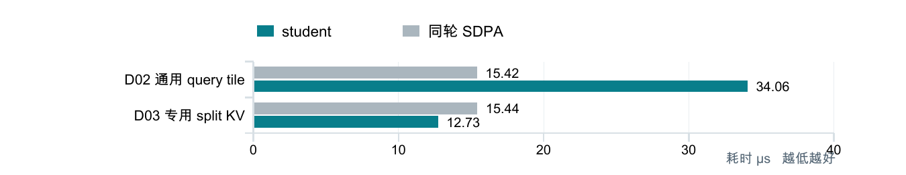
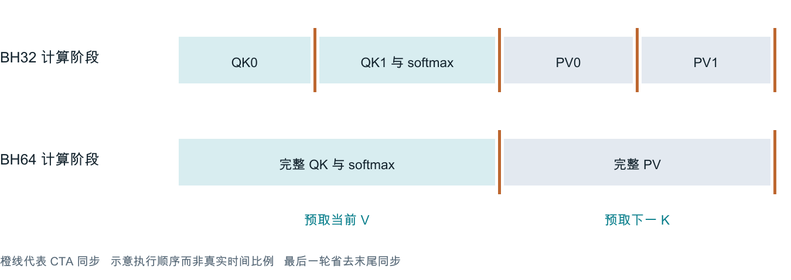

# BF16 Attention 前向优化路径报告

A100 上从可运行实现到接近 FlashAttention 的工程复盘

记录范围  2026年10月7日至8日    项目  Tiny Transformer

本轮优化围绕 BF16 causal attention 前向展开：先修复接口和边界错误，再用独立计时与 NCU 定位开销，逐步调整 tile、预取、寄存器预算、mask 和行内归约。最新用户报告的 prefill 耗时为 42.34 µs，同轮 SDPA 为 39.27 µs，差距收敛到 3.07 µs。

| 最新 student prefill | 同轮 SDPA FlashAttention | 剩余耗时差 |
| --- | --- | --- |
| 42.34 µs | 39.27 µs | 3.07 µs |

同轮速度比为 SDPA / student = 0.93×；student 的延迟仍高约 7.8%。初始 Graph 记录为 100.42 µs，后期沿用 Graph 语境的结果下降至 42.34 µs，端点参考性降幅约 57.8%。该端点比较不等于严格配对实验，测量证据分级见后文。



图 1 优化主线 先保证可比 再以实测选择取舍

### 汇报应强调的三个结论

- 有效收益来自组合：数据搬运与同步优化建立基础，mask 和 int32 减少标量工作，最后的延迟归约与倒数复用再降低约 9.4% 的阶段耗时。

- 资源指标不是最终目标：更高 occupancy、零 spill、更高 sector 利用率，都不必然使 kernel 更快。

- 已有反例并及时回退：更紧的 launch bounds、shared-memory 输出重排均未获得净收益；base-2 单独实验没有明显收益。

测量场景：A100 80GB PCIe；BF16；B=8、H=12、D=64；prefill Tq=Tk=512；20 次预热、每轮 100 次调用、5 轮采样。

## GPU 执行路径的性能演进

下图只列 Graph 或沿用 Graph 语境的记录。灰色为同轮 SDPA，青色为 student；标注“回退”的候选未进入保留路径。图中跳过的 operator 阶段另列下一页，因此相邻条目不能全部解释为单一改动的收益。



图 2 Graph 口径的观测序列  G07 至 G09 带星号表示完整命令未附在结果片段中

| 对照 | 变化 | 结论 |
| --- | --- | --- |
| G03 → G04 驻留目标 4 → 5 | 50.61 → 53.16 µs  +5.0% | 退回目标 4 |
| G03 → G05 base-2 | 50.61 → 51.11 µs  +1.0% | 未测出明显收益 |
| G05 → G06 int32 | 51.11 → 48.71 µs  -4.7% | 保留 |
| G07 → G09 归约与倒数组合 | 46.73 → 42.34 µs  -9.4% | 最新已测保留版本 |

证据边界：G07、G08、G09 沿用此前 Graph 测试上下文，但用户贴出的片段只有结果行，没有完整 CLI。本文保留这些结果并明确标记；不据此宣称所有中间改动都被严格隔离，亦不提供缺失的置信区间。

## 完整算子口径与 decode 改善

operator 计时包含完整 eager 调用，可能包含 CPU 提交造成的 GPU 间隙；它适合回答“调用一次算子需要多久”。下图五条记录均来自未挂 NCU 的 operator 日志。



图 3 Operator 路径  预取与 CTA 改动的收益不能拆成独立百分比

| 阶段对照 | student 延迟下降 | 说明 |
| --- | --- | --- |
| O02 → O03 | 29.5% | 预取 CTA 与 fragment 相关组合 |
| O03 → O04 | 10.1% | mask fast path 阶段  版本归因有保留 |
| O04 → O05 | 6.9% | BK 从 32 增至 64 |
| O05 → O06 | 11.1% | launch bounds 的驻留目标设为 4 |

### 单 token decode 采用独立执行路径



图 4 Decode 的 Graph 对照  Tq=1 Tk=512

通用 kernel 为 1 个 query 仍执行 64 行 tile。专用路径按 128 个 key 分块并用 FP32 合并 softmax，Graph 从 34.06 降至 12.73 µs，快 2.68 倍，同轮达到 SDPA 的 1.21× 速度。适用范围为 Tq=1、Tk≤4096，不计入 prefill 收益。

## Tile 与流水线如何演化

最终保留的主线遵循 Q 整块保留在 shared memory、P 和 O 在寄存器的设计。K/V 从特征 subtile 发展到完整 head-dimension tile，以更多共享内存换取较少的阶段切换。

| 配置阶段 | Q 与 KV 存储 | 共享内存每 CTA | 状态 |
| --- | --- | --- | --- |
| 初始模板 | Q 8 KiB  P 8 KiB<br>K 与 V 各两份完整 tile | 48 KiB | 正确性起点 |
| Q 常驻寄存器候选 | Q 借用 V 缓冲后进入寄存器<br>P 改为寄存器转换 | 32 KiB | 未单独验证收益 后续放弃 |
| BK32 BH32 | Q 8 KiB<br>两个 K/V union stage 各 2 KiB | 12 KiB | 资源压缩探索 |
| BK64 BH32 | Q 8 KiB<br>两个 union stage 各 4 KiB | 16 KiB | 减少 KV 迭代 |
| BK64 BH64 | Q 8 KiB  K 8 KiB  V 8 KiB<br>K/V 两个完整 slot | 24 KiB | 最终已测布局 |



图 5 以更大的特征 tile 减少同步切换

BK=32→64 时，T=512 每个 head 的 KV tile 处理总数从 72 降到 36。BH=32→64 时，去掉 DH 方向的两段循环；每个 CTA 处理 N 个 KV 块的同步总数从 4N 降到 2N，含 prologue 和最后一轮收尾。S/P/O 的大小在 BH 变化时不变，但 PV 临时 B fragment 会增大。

K/V 行宽改变时必须同步修改 swizzle。32-BF16 行最终使用 Swizzle<2,3,3>，64-BF16 行使用 Swizzle<3,3,3>。错误的 Swizzle<2,3,2> 保持了数值布局可逆性，却让相隔四行的片段发生 bank 冲突。

## 减少非 MMA 指令的关键收益

### 完整合法块跳过逐元素 mask

在 query tile 和 key tile 都完整、且最早 query 已能看到该 key 块最后位置时，整个 tile 无需 causal 判断。其余块保留逐元素检查。BK=64、T=512 时，每个 head 的 36 个 KV tile 中有 28 个完整合法块。该阶段 operator 从 69.90 降到 62.86 µs，约改善 10.1%，但与 N=8 展开回撤的版本对应尚未完全固化。

### 用 int32 表达索引 保留 int64 地址偏移

tile 计数、行列坐标与 mask 比较改用 int32；host 在连续化与分配前检查 Tk≤INT32_MAX。row×DH 和 batch/head 偏移在乘法前提升为 int64。因果比较写成 kj-past_len≤qi，尾块先限长再相加，避免 padded 索引溢出。Graph 从 51.11 降到 48.71 µs，约改善 4.7%。

### 分母累计留在线程局部 最后再归约

当前每行由四个 lane 合作。每轮仍计算本 lane 的指数和，并以共同的 alpha 重缩放历史累计值；循环中无需完整行分母，所以可以把跨 lane 求和推迟到末尾。行最大值仍须每轮跨 lane 归约。

| 同一逻辑行 | lane 0 | lane 1 | lane 2 | lane 3 |
| --- | --- | --- | --- | --- |
| tile 0 后的累计部分和 | 2 | 3 | 4 | 1 |
| tile 1 新增部分和 | 1 | 2 | 1 | 4 |
| alpha=0.5 后的累计值 | 2 | 3.5 | 3 | 4.5 |

```text
for each KV tile:
    l_partial = alpha * l_partial + local_sum

denominator = row_sum(l_partial)  # after all KV tiles
inv_l = 1.0f / denominator
O = O_acc * inv_l
```

最终 shuffle 必须由尾块中所有 lane 参与，放在 qi<Tq 判断之前。倒数按每线程负责的每行计算一次，而非更新或保存以前的 S tile。对于遍历 N 个 KV 块的 CTA，分母相关 shuffle 从每线程 4N 次降为 4 次；源码中的输出除法从最多 32 次降为 2 次。

两项一起测量得到 46.73→42.34 µs，下降 9.4%。没有新增 shared-memory 访问或 CTA barrier；单项收益尚未拆分。浮点求和顺序和除法改写会改变舍入，需要继续使用 FP64 O/LSE 对照。

## 无收益实验与正确性修复

优化记录保留失败结果，避免在后续迭代中重复追求已经被实测否定的资源指标。下表中的“未隔离”表示不能依据现有日志给出单项速度贡献。

| 实验 | 观测 | 处理 |
| --- | --- | --- |
| 完整 Q 常驻寄存器 | 减少 shared memory 但增大寄存器工作集<br>没有可归因的独立提速记录 | 回到 Q shared memory |
| 手写 N=8 的 B fragment 展开 | 组合版本 128 registers<br>20 B spill stores 28 B spill loads | 展开回撤<br>预取和 CTA 排列保留 |
| launch bounds 从 4 提到 5 | Graph 50.61→53.16 µs<br>慢约 5.0% | 采用目标 4 |
| base-2 softmax | Graph 50.61→51.11 µs<br>约 1% 差异 未显示明显收益 | 保留为后续受控基线<br>不计为独立提速 |
| Q shared memory 重排输出 | 46.73→48.17 µs<br>慢约 3.1% | 撤回 直接 32-bit pair 写回 |
| int32 下重试自然指数 | 曾准备候选 用户明确要求改做 KV tile<br>没有 GPU 性能结果 | 未测量 已撤回 |
| 更高 occupancy 或零 spill | 更多驻留 warp 不保证更低延迟<br>有少量 spill 的组合版本仍可能更快 | 按正确性与时间决定 |

### 性能实验之前先修复的功能问题

- 绑定与参数：修复 dtype 恒假条件、BF16 类型与指针调用、错误变量名、模板实参；LSE 使用 FP32，启动分配正确的动态共享内存。

- 输入契约：拒绝混合 dtype 和 BF16 segment IDs，检查 SM80 与 grid 上限；连续 view 的 storage_offset 仍可能不对齐，必要时 clone 保证 16-byte 对齐。

- 测试对照：未对齐原始 view 仍交给 student；SDPA 参考使用值相同的对齐副本。一次 CUDA misaligned-address 错误可能污染后续用例，需新进程重跑。

- 编译兼容：坐标 tensor 的 ScaledBasis stride 不能直接用于 fragment 排序，改为取 shape 后分配；误用 __exp2f 改为 CUDA 支持的 exp2f。

## Profiler 证据如何改变判断

| 证据 | 观测 | 工程判断 |
| --- | --- | --- |
| Shared-load bank conflict | 曾占 shared wavefronts 43.60%<br>修正 swizzle 后用户确认排除 | 地址模式确有问题<br>但不是全部耗时来源 |
| Global store sector 有效字节 | 约 8.19→16.2 / 32 bytes | 32-bit pair 写回改善合并<br>更大重排仍可能得不偿失 |
| Warp 等待 | Short Scoreboard 约 0.83→0.32<br>Long Scoreboard 在后续版本约 1.23→0.74 | 分别与 shared 冲突缓解<br>和加载重叠方向一致 |
| Occupancy | 理论 25%<br>一次实测 23.73%  15.19 active warps/SM | 接近该版资源上限<br>不等于始终有可发射 warp |
| Tail effect | 768 CTA  108 SM  4 CTA/SM<br>432+336 两波 | 50% 提示不是 50% 可消除耗时<br>causal CTA 时长也不均匀 |

### 编译资源必须按 kernel 和版本匹配

| BF16 forward 阶段 | Registers | Stack B | Spill store/load B |
| --- | --- | --- | --- |
| 修正 swizzle 后的一版 | 约 120 至 121 | 0 | 0 / 0 |
| N=8 展开等组合 | 128 | 16 | 20 / 28 |
| BK64 BH32 | 157 | 0 | 0 / 0 |
| launch bounds 4 | 128 | 0 | 0 / 0 |
| int32 base-2 | 128 | 8 | 4 / 4 |
| BH64 完整 K/V | 121 | 0 | 0 / 0 |
| 最新延迟归约与倒数版本 | 未提供 | 未提供 | 未提供 |

早期日志中的 96 registers 属于 FP32 attention_detail::forward，不是 BF16 kernel。used 1 barriers 表示 barrier 资源，不是动态执行一次同步。24 KiB 属于动态共享内存，未必出现在 ptxas 的静态 smem 字段中。

当前 128-thread CTA 在 A100 上约 121/128 registers 时，寄存器分配限制为 4 CTA/SM；157 registers 时约为 3 CTA/SM。NCU 的估计加速百分比不能相加，stall 图的周期/指令也不能直接当作总耗时占比。

## 完整测量记录与口径标记

所有数值均取自用户粘贴的终端结果，单位 µs。G 为 Graph，G* 为沿用 Graph 语境但缺少完整命令的结果片段，O 为 operator，X 为挂 NCU 的诊断运行。X 项仅解释测量干扰，不纳入加速结论。

| ID | 方式 场景 | 阶段 | student | SDPA | 速度比 |
| --- | --- | --- | --- | --- | --- |
| O01 | O/P | 最初可运行 BF16 | 101.92 | 40.92 | 0.40× |
| D01 | O/D | 通用 query tile | 35.44 | 30.15 | 0.85× |
| G01 | G/P | 初始 Graph 对照 | 100.42 | 39.37 | 0.39× |
| D02 | G/D | 通用 query tile | 34.06 | 15.42 | 0.45× |
| G02 | G/P | 小 KV tile 与 union | 98.08 | 39.29 | 0.40× |
| D03 | G/D | 专用 split KV | 12.73 | 15.44 | 1.21× |
| X01 | X/P | 仅一次预热和采样 | 209.92 | 258.05 | 1.23× |
| X02 | X/P | 恢复 20 100 5 采样 | 102.79 | 158.28 | 1.54× |
| O02 | O/P | 无 NCU 复测 | 99.10 | 41.19 | 0.42× |
| O03 | O/P | 预取与 CTA 组合优化 | 69.90 | 41.25 | 0.59× |
| O04 | O/P | 完整块 mask fast path | 62.86 | 41.11 | 0.65× |
| O05 | O/P | BK 从 32 增至 64 | 58.51 | 41.31 | 0.71× |
| O06 | O/P | launch bounds 4 | 52.03 | 41.18 | 0.79× |
| G03 | G/P | launch bounds 4 | 50.61 | 39.52 | 0.78× |
| G04 | G/P | launch bounds 5 回退 | 53.16 | 39.26 | 0.74× |
| G05 | G/P | base 2 softmax | 51.11 | 39.39 | 0.77× |
| G06 | G/P | int32 索引 | 48.71 | 39.23 | 0.81× |
| G07 | G*/P | BH 从 32 增至 64 | 46.73 | 39.35 | 0.84× |
| G08 | G*/P | shared O 重排 回退 | 48.17 | 39.27 | 0.82× |
| G09 | G*/P | 延迟归约与倒数复用 | 42.34 | 39.27 | 0.93× |

P=prefill，D=decode。速度比始终为 SDPA/student，大于 1 表示 student 更快。多个结果写入同一 JSON 路径，原始 trial 数组未完整保留在对话中，因此本报告不提供误差条或显著性检验。

## 复现方式与后续实验

汇报与复测环境为 A100 80GB PCIe、PyTorch 2.8.0a0+34c6371d24.nv25.08。用户 profiler 已确认 prefill 与 decode 都经过 aten::_scaled_dot_product_flash_attention。其具体 tile 配置不能仅由这个 ATen 名称推断。

### 固定输入与计时方式

```text
TORCH_CUDA_ARCH_LIST=8.0 python3 -m tiny_transformer.benchmarks \
  --operator attention --backend student --baseline sdpa \
  --precision bf16 --device cuda:1 --phases forward \
  --workloads prefill --attention-timing graph \
  --layouts contiguous --batch-size 8 --heads 12 \
  --dim 768 --seq-length 512 --warmup 20 --repeats 100 --trials 5 \
  --output runs/attention-delayed-denom-graph.json
```

operator 与 Graph 分别报告；不在挂 NCU 的 benchmark 输出中判断谁更快。NCU 内核 Duration 和硬件计数器用于定位问题，无 NCU 的独立运行用于速度结论。缺少 TORCH_CUDA_ARCH_LIST 可能改变 JIT 编译架构并触发重新编译，编译等待不计入稳态计时。

### 正确性与编译资源

```text
TORCH_CUDA_ARCH_LIST=8.0 TINY_TRANSFORMER_CUDA_VERBOSE=1 \
python3 -m unittest discover -s tests \
  -p test_student_attention.py -k bf16 -v
```

再运行 compute-sanitizer 的 memcheck、racecheck、synccheck。已有测试覆盖 FP64 O/LSE、因果隔离、query/key 尾块、非连续和未对齐 view、非默认 stream、Graph 重放与溢出拒绝。报告主机无 CUDA；本地模型与跳过的 GPU 测试不能替代目标设备验收。

### 保留版本和待验证工作

最新已报告 42.34 µs 对应“延迟归约与倒数复用”阶段，Git 记录为 8732172；其最终 ptxas 和完整 sanitizer 结果尚未在对话提供。生成报告时，工作区另有未提交的 PV 寄存器双缓冲实验，不计入 42.34 µs 的收益。下一轮应只比较 PV 的 ldmatrix 提前加载，保持 tile、softmax、bounds 和输出路径一致。40 KiB 完整 K/V 双缓冲与 128×128 大 tile 仅为备选，未得到本次测量验证。

### 源码依据与数据来源

[FlashAttention v2.8.3 softmax  延迟分母归约与最终倒数](https://github.com/Dao-AILab/flash-attention/blob/v2.8.3/csrc/flash_attn/src/softmax.h)

[FlashAttention v2.8.3 utils  ldmatrix 与 MMA 交错](https://github.com/Dao-AILab/flash-attention/blob/v2.8.3/csrc/flash_attn/src/utils.h)

[Triton v3.4.0 官方 fused attention 教程  OpenAI kernel team](https://github.com/triton-lang/triton/blob/v3.4.0/python/tutorials/06-fused-attention.py)

本地依据：csrc/attention/development.md、attention_forward_BF16_kernel.cuh、tests/test_student_attention.py、Git 提交及本对话用户日志/NCU 截图。CUTLASS example 41 和 FlashAttention 上游用于设计对照，不等同于已确认的 NGC 内部版本。
