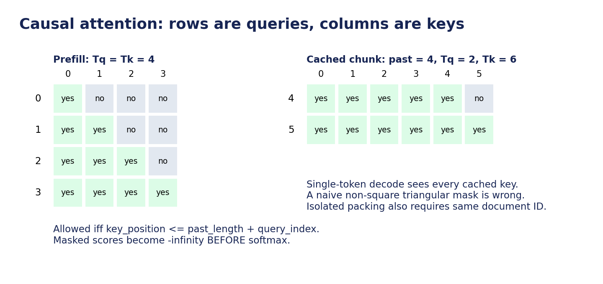
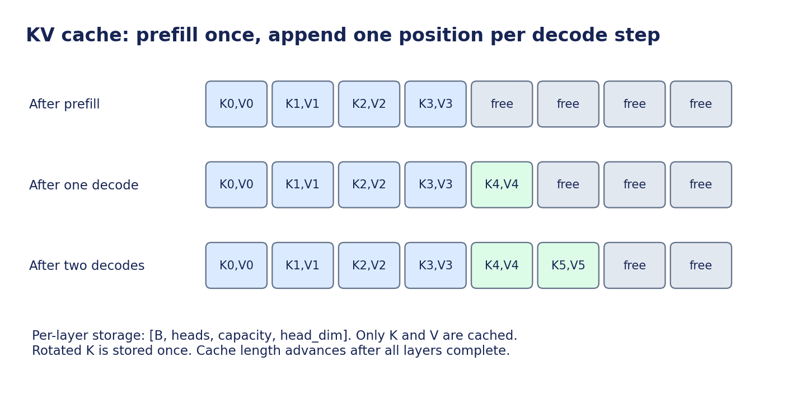

# Transformer 算法手册：从 token 到训练与解码

这份手册针对熟悉 CUDA/C++、但尚未系统学习深度学习的开发者。
目标是让你能回答：模型计算了什么，张量形状为什么如此，梯度怎样流动，缓存为什么正确。
实现细节和优化实验见 [开发手册](development.md)。

## 0. 阅读路线和符号

第一次阅读按 1→8→9→10 的顺序理解前向、loss、训练、推理，再读反向推导和复杂度。
每读完一个算子，同时打开 `tiny_transformer/operators/reference.py` 找到对应表达式。
不要先背 API；先在纸上写出输入、输出和每个维度的含义。

| 符号 | 意义 | 本项目默认值 |
|---|---|---:|
| $B$ | microbatch 中的序列数 | 8 |
| $T$ | 本次输入的序列长度 | 训练 512 |
| $H$ | hidden dimension / residual stream 宽度 | 768 |
| $L$ | block 层数 | 8 |
| $N_h$ | attention head 数 | 12 |
| $D_h$ | 每个 head 的宽度，$D_h=H/N_h$ | 64 |
| $I$ | SwiGLU 中间宽度 | 2048 |
| $V$ | 词表大小 | 8192 |
| $C$ | 已分配 KV cache 的位置容量 | 随请求指定 |

shape 是逻辑维度，不保证张量连续。张量从 $[B,T,N_h,D_h]$ transpose 成 $[B,N_h,T,D_h]$
通常只是改变 stride；理解这一点会直接影响 CuTe/CUDA kernel 的正确性。

## 1. 模型到底学习什么

语言建模将一段文本的概率拆为条件概率：

$$
p(x_0,\ldots,x_n)=\prod_{t=0}^{n}p(x_t\mid x_{<t})
$$

本项目让每个输入位置预测下一个 token。例如：

```text
原始 token： BOS   A   B   C   EOS
输入 ids：  BOS   A   B   C
目标 y：     A   B   C   EOS
```

token 是 tokenizer 的离散编号，不一定是单词或单个字符。byte tokenizer 把 UTF-8 字节映射为编号；
BPE 则将常见字节片段逐步合并成更长的 token。训练 tokenizer 本身不需要 GPU。

一次训练前向同时产生所有位置的预测。因果约束保证位置 $t$ 不能访问 $t$ 后面的输入。
因此“所有位置并行计算”和“不能看见未来”并不冲突。

训练集用来更新参数，验证集只评估泛化。验证文本不能参与 BPE 训练或模型参数更新。
本项目提供的 synthetic smoke 语料只用于功能验收；其 loss 下降不代表真实语言能力。

## 2. 整体计算图与参数


前向主线是：

$$
\text{IDs}\to\text{Embedding}\to\text{Block}^{\times L}
\to\text{RMSNorm}\to\text{LM Head}\to\text{logits}
$$

训练在 logits 上计算交叉熵。推理对最后一个位置的 logits 选择下一个 token。

一个 pre-norm block：

$$
h=x+\operatorname{AttentionBranch}(\operatorname{RMSNorm}(x))
$$

$$
y=h+\operatorname{FFN}(\operatorname{RMSNorm}(h))
$$

残差连接使原表示通过一条直接路径向后传递。反向时，加法把上游梯度分发给两条分支，
从而提供直接的梯度路径。它并不保证任何配置都稳定，但有助于训练深网络。

本项目不使用 bias、dropout、GQA、MoE 或额外位置 embedding，减少第一阶段的概念负担。
RoPE 在 attention 内引入位置信息。

参数量可直接推导：

$$
P=VH+L(4H^2+3HI+2H)+H=62{,}927{,}616
$$

其中 $4H^2$ 是 Q/K/V/O，$3HI$ 是 gate/up/down，$2H$ 是每层两个 RMSNorm 的缩放参数。
输入 embedding 和输出 LM head 共享权重，所以 $VH$ 只计算一次。

## 3. Embedding 与 Linear：先连接到熟悉的 GEMM

Embedding 权重 $E\in\mathbb{R}^{V\times H}$ 是可训练表格：

$$
X_{b,t,:}=E_{\mathrm{ids}_{b,t},:}
$$

这一步是 gather。反向对同一个 token 的所有出现位置累加梯度，相当于带重复索引的 scatter-add。
同一个 token 在不同上下文中起初取到相同向量，但经过 attention 后会形成不同的上下文表示。

本项目 Linear 权重始终按 PyTorch 的 `[out_features,in_features]` 存储：

$$
Y=XW^\top
$$

将 $X\in\mathbb{R}^{B\times T\times K}$ 的前两维合并，则 GEMM 的矩阵形状为
$(M\times K)\cdot(K\times N)\longrightarrow(M\times N)$，其中 $M=B\times T$。

| 投影 | 存储的权重 | 输出 |
|---|---|---|
| 合并 QKV | $[3H,H]$ | $[B,T,3H]$ |
| Attention O | $[H,H]$ | $[B,T,H]$ |
| 合并 gate/up | $[2I,H]$ | $[B,T,2I]$ |
| FFN down | $[H,I]$ | $[B,T,H]$ |
| LM head | $[V,H]$ | $[B,T,V]$ |

合并 QKV 或 gate/up 是把具有共同输入的独立 Linear 合并为更大的 GEMM，计算语义不变。
QKV 和 gate/up 的切片可能是非连续视图，后续算子必须处理这一点。

Linear 的反向：

$$
dX=dY W,\quad dW=dY^\top X
$$

所以训练中的一个 Linear 对应前向、输入梯度、权重梯度三类 GEMM。
训练使用较大的 $M$，单 token decode 中 $M=B$，两者最优 tile 与利用率可能很不同。

## 4. RMSNorm：按 token 对通道归一化

对一个 token 的 $H$ 维向量：

$$
r=\left(\frac{1}{H}\sum_{j=1}^{H}x_j^2+\epsilon\right)^{-1/2},
\quad y_i=x_i r\gamma_i
$$

$\gamma\in\mathbb{R}^{H}$ 是可训练缩放参数；本项目没有 $\beta$。RMSNorm 不减均值，因此不同于 LayerNorm。
归约轴只有最后一维 $H$，不跨 batch、sequence 或 head。

FP16/BF16 输入的平方和使用 FP32 累加。参考实现先转为 FP32，计算后再转回输入 dtype。
$\epsilon$ 防止分母为零，不能省略或移动到平方根之外。

反向推导可用于验证自己的 kernel。记训练损失为 $\mathcal{L}$，设上游梯度为
$g_i=\frac{\partial\mathcal{L}}{\partial y_i}$，$u_i=g_i\gamma_i$：

$$
\frac{\partial\mathcal{L}}{\partial x_i}
=r u_i-\frac{r^3 x_i}{H}\sum_j u_jx_j
$$

$$
\frac{\partial\mathcal{L}}{\partial\gamma_i}=\sum_{\text{所有行}}g_i x_i r
$$

第一式需要行内归约；第二式需要跨行累加。因此“前向每行一个 block”不能自动给出高效的 $\gamma$ 梯度方案。
训练时还要决定保存 $r$、重计算 $r$，或保存更多中间量；保存换计算，但消耗显存和带宽。

## 5. RoPE：通过旋转使 Q/K 带有位置关系

先将 Q/K 划分为 heads：$[B,N_h,T,D_h]$。本项目每两个相邻通道组成一对：

$$
\theta_j=\mathrm{base}^{-2j/D_h},\quad \phi_{p,j}=p\theta_j
$$

$$
\begin{pmatrix}x'_{2j}\\x'_{2j+1}\end{pmatrix}
=\begin{pmatrix}\cos\phi&-\sin\phi\\\sin\phi&\cos\phi\end{pmatrix}
\begin{pmatrix}x_{2j}\\x_{2j+1}\end{pmatrix}
$$

旋转保留每一对分量的平方和。位置 $p$ 的 Q 与位置 $q$ 的 K 做内积时，会引入两者的相对旋转，
使 attention 可以利用相对位置。

注意三个约定：

1. 只旋转 Q/K，不旋转 V。
2. 本项目使用 adjacent-pair，即 $(0,1),(2,3),\ldots$。一些实现用 split-half 配对，不能直接混用权重与 kernel。
3. decode 的 position 必须是已有 cache 长度，不能每次重置为 0；缓存里保存的是已经旋转的 K。

计算 sin/cos 的相位使用 FP32；以低精度表示大位置可能带来明显误差。
旋转矩阵的反向是其转置，即相反角度的旋转。这里的频率不是可训练参数。

## 6. Causal Self-Attention：交换位置之间的信息

对一个 batch 中的一个 head：

$$
S=\frac{QK^\top}{\sqrt{D_h}},\quad P=\operatorname{softmax}(S+M),\quad O=PV
$$

Q、K、V 的概念分别是：当前位置用什么特征查询；每个位置提供什么匹配特征；最终取回什么信息。
它们都是输入经过学习到的线性变换所得，不是预先标注的“问题、答案”。

$S\in\mathbb{R}^{T_q\times T_k}$ 的一行对应一个 query，列对应 keys。
除以 $\sqrt{D_h}$ 是为控制内积的尺度，避免维度增大时 softmax 过早饱和。



### 6.1 因果 mask

训练和普通 prefill 中：$\text{允许访问}\iff\mathrm{key\_index}\le\mathrm{query\_index}$。
非法位置在 softmax **之前**被置为负无穷。这样其指数为零。
若在 softmax 后直接置零却不重新归一化，一行权重之和不再是 1。

缓存查询中，若已有 $p$ 个位置，则条件变成：

$$
\mathrm{key\_index}\le p+\mathrm{query\_index}
$$

例如 $p=4,\ T_q=2,\ T_k=6$，两个 query 分别能看见 5 个和 6 个 key。
不能直接对 $2\times6$ 矩阵应用从左上角开始的普通三角 mask。
本项目 SDPA 路径在这种情况下传入显式 mask；单 token decode 直接允许访问全部已缓存 key。
PyTorch SDPA 的 bool mask 中 `True` 表示允许参与 attention，要留意其他 API 可能采用相反含义。

### 6.2 Softmax 与数值稳定

一行 softmax 的稳定写法：

$$
m=\max_j s_j,\quad e_j=\exp(s_j-m),\quad p_j=\frac{e_j}{\sum_k e_k}
$$

减去最大值不改变结果，能避免指数溢出。至少应有一个合法 key，否则全为负无穷会产生未定义结果。
本项目每个 query 至少可以看见自己。

若上游梯度为 $g$，softmax 的反向是：

$$
ds_i=p_i\left(g_i-\sum_j g_jp_j\right)
$$

Attention 反向的结构：

$$
\begin{aligned}
O&=PV
&&\Longrightarrow\quad dV=P^\top dO,\quad dP=dO\,V^\top,\\
P&=\operatorname{softmax}(S+M)
&&\Longrightarrow\quad dS=\operatorname{SoftmaxBackward}(P,dP),\\
S&=\frac{QK^\top}{\sqrt{D_h}}
&&\Longrightarrow\quad dQ=\frac{dS\,K}{\sqrt{D_h}},\quad dK=\frac{dS^\top Q}{\sqrt{D_h}}.
\end{aligned}
$$

其中 $dS$ 通过上面的 softmax 反向公式做行内归约得到，非法位置的梯度保持为零。

### 6.3 多头与输出投影

每个 head 独立计算 attention，再把 $[B,N_h,T,D_h]$ 合并回 $[B,T,H]$，经过 O Linear。
多头允许学习不同的相互作用，但不能保证每个 head 都能被人为赋予明确的语义标签。

### 6.4 SDPA / FlashAttention 改变了什么

朴素 attention 保存 $S$ 和 $P$，每个都包含 $B\times N_h\times T^2$ 个元素。
分块的 FlashAttention 路径在片上处理 tiles，并使用 online softmax 合并归一化统计量，避免将完整概率矩阵写回 HBM。
它通常仍执行平方级的 dense attention 算术；主要改进是中间数据流和实际执行效率。

SDPA 是框架接口，会根据设备、dtype、shape、mask 和环境选择不同后端。
调用 SDPA 不等于已证明用了 Flash kernel；最终以 Profiler/后端诊断为准。

## 7. SwiGLU FFN：逐位置处理特征

$$
g=XW_g^\top,\quad u=XW_u^\top
$$

$$
z=\operatorname{SiLU}(g)\odot u,\quad Y=zW_d^\top
$$

其中 $g,u,z$ 都是 $[B,T,I]$，$\operatorname{SiLU}(x)=x\sigma(x)$，$\sigma$ 表示 sigmoid 函数。
gate 调制 up 分支的特征，最后由 down 投影回 $H$ 维，才能与 residual 相加。

同一位置的通道会相互混合；不同位置共享权重，但 FFN 本身不会跨位置读数据。
Attention 负责跨位置交互，FFN 负责逐位置非线性变换。

反向时：

$$
\operatorname{SiLU}'(g)=\sigma(g)+g\sigma(g)(1-\sigma(g))
$$

$$
dg=dz\odot u\odot\operatorname{SiLU}'(g),\quad du=dz\odot\operatorname{SiLU}(g)
$$

这适合学习融合：独立 sigmoid、乘法会产生中间张量；融合 kernel 可在寄存器中完成。

## 8. LM head、Cross Entropy 与“学会”的含义

最终隐藏状态经过词表投影，logits 的形状为 $[B,T,V]$。logit 是未归一化分数。
训练目标是正确 token 的负对数概率：

$$
\ell=-z_y+\log\sum_{j=1}^V\exp(z_j)
$$

实际使用稳定的 log-sum-exp。参考 loss 在低精度训练时转为 FP32 计算。
不需要先显式构建完整 softmax 再取 log。

平均 loss 对所有有效目标 token 求平均，`-100` 表示不计入 loss。
对一个位置的 logits 梯度是 $p-\operatorname{one\_hot}(y)$，再除以有效 token 数。
perplexity 为 $\exp(\mathcal{L})$，其中 $\mathcal{L}$ 是平均 loss；只能在相同 tokenizer、语料和评估规则下合理比较。

共享 embedding/LM head 权重意味着同一个参数既收到输入查表的梯度，也收到输出投影的梯度。
参数不能在 optimizer 中注册两次。本项目使用同一个 Parameter 对象，`model.parameters()` 会去重。

## 9. 数据打包与训练流程

### 9.1 两种 packed batch 语义

数据准备把每篇文档编码为 BOS、正文 token 与 EOS 的顺序拼接，再拼成 token 流。
dataset 随机取长度 $T+1$ 的窗口，前 $T$ 个是 input，后 $T$ 个是 target。
**标签偏移只发生一次**，模型和 loss 不再重复 shift。

```text
连续模式：   BOS a b EOS BOS c d EOS
attention： 每个位置可看见窗口中所有更早的位置
position：  0   1 2 3   4   5 6 7

隔离模式：   BOS a b EOS | BOS c d EOS
segment：   0   0 0 0   | 1   1 1 1
position：  0   1 2 3   | 0   1 2 3
```

连续模式把文档串联当作连续语料，允许跨文档 context。
隔离模式同时要求因果约束与 segment 相同，并忽略 `EOS → 下一篇 BOS` 的预测目标。
随机窗口可能从文档中部开始；本项目把窗口的第一位置视为该局部上下文的 position 0。
这不意味着已经看见窗口之前的 token。

隔离模式使用显式 mask，可能影响 SDPA 后端选择和速度；比较性能时不能悄悄改变这项语义。

### 9.2 一个 optimizer step

```text
清空梯度
  → 取 grad_accum 个 microbatches
  → 每个 microbatch：forward → loss → backward
  → 按有效 target 数加权累积梯度
  → FP16 时 unscale
  → 梯度裁剪
  → AdamW 更新
  → 更新学习率 / 记录指标
```

autograd 记录可微操作并沿计算图反向应用链式法则。
参数是持久状态，激活是本次计算的中间结果，梯度是 loss 对参数/激活的导数，optimizer state 是优化器额外维护的状态。
这四种对象不能混为一谈。

AdamW 为参数维护一阶、二阶矩估计，并施加解耦 weight decay。
学习率过大可能造成 loss 发散；过小会学习缓慢。先用固定小 batch 过拟合，是检查训练正确性的好方法。

### 9.3 精度

| 模式 | 参数/Adam 状态 | 主要计算 | 额外处理 |
|---|---|---|---|
| FP32 | FP32 | FP32，TF32 默认关闭 | 作为数值基线 |
| BF16 | FP32 | autocast 选择 BF16 | 归约/loss 适当使用 FP32 |
| FP16 | FP32 | autocast 选择 FP16 | GradScaler，防止小梯度下溢 |

autocast 不意味着每个张量都变为 BF16。FP32 residual 与 norm 路径可能保留 FP32，GEMM 输出可能是 BF16。
自定义算子必须处理真实输入 dtype，不能把“训练 precision=bf16”理解为“所有指针都是 bf16”。
本框架发现非有限 loss 或 FP32/BF16 梯度时会尽早失败。FP16 梯度溢出由 GradScaler 跳过更新并降低 scale，
日志记录 `optimizer_step_skipped`；若持续出现，需检查输入、算子和缩放设置。step/LR schedule 按尝试的训练步计数，
正式对照中还应检查实际跳过的更新数。

推理会直接将模型权重转换为所选精度，与训练的 FP32 master parameter 策略不同。

## 10. Prefill、Decode 与 KV Cache



### 10.1 Prefill

输入整段 prompt，所有 prompt 位置并行完成前向。
每层保存该 prompt 的 K/V；最后一个位置的 logits 产生第一个输出 token。
因此 TTFT 主要覆盖 prefill 和第一次 token 选择。

### 10.2 Decode

将刚生成的 token 作为下一次模型输入，计算它自己的 Q/K/V。
把新 K/V 写到 cache 的下一位置，新 Q 与全部缓存 K/V 做 attention。
最后得到再下一个 token。

缓存正确的原因：在 causal decoder 中，已有位置的隐藏状态不依赖未来 token，
所以其每层 K/V 不会因追加 token 而改变。条件是模型权重、位置定义、输入序列等保持一致。

本项目 cache 的每层布局为 $[B,N_h,C,D_h]$，预分配容量，前缀是视图；每步原位写入，
避免 `torch.cat` 反复复制全部历史数据。缓存长度在所有层完成后才统一增加。
预填充后第一个输出 token 尚未写入 cache；下一次 decode 才把它作为输入写入。

总缓存字节数：

$$
\mathrm{KV\ bytes}=2\times L\times B\times C\times H\times\operatorname{bytes}(\mathrm{dtype})
$$

BF16 默认模型每个 batch、每个 token 需要 24 KiB KV；$B=1$、$C=2048$ 时约 48 MiB。
这个公式基于普通多头 attention，GQA/MQA 会改变 K/V head 数，不能直接沿用。

cache 只用于 eval + no_grad/inference_mode，不能直接复用为训练激活缓存。
reset 只改变有效长度，不必清零整块显存，因为 attention 只读取有效前缀。

## 11. 复杂度为什么决定优化顺序

| 阶段 | Linear 的主要规模 | Attention 主要规模 | 常见限制 |
|---|---|---|---|
| 训练 / prefill | $M=B\times T$，较大 GEMM | $QK^\top$ 与 $PV$ 的计算量随 $T^2$ 增长 | Tensor Core 利用率、激活/中间显存 |
| 小 batch decode | $M=B$，瘦 GEMM/GEMV | 单 Q 读取历史 K/V | 权重与 cache 带宽、launch、CPU 调度 |

忽略 logits 等部分，dense attention 的两个矩阵乘约需 $4BT^2H$ FLOPs/层（一次乘加记 2）。
单步 decode 大致随历史长度线性增长，并非总生成过程都为线性复杂度。

例如 $B=8$、$N_h=12$、$T=4096$，单个 BF16 $B\times N_h\times T\times T$ 张量就约 3 GiB。
这解释了为什么长序列下不能仅凭“模型参数只有约 120MB BF16”估算训练显存。

$6\times\text{参数量}\times\text{训练 token 数}$ 是常见训练 FLOPs 粗估，忽略或简化 attention 等开销；
长序列或精确 MFU 报告应采用更完整的计数。

## 12. 动手检查：能解释这些，才算掌握主线

1. 对 $B=2$、$T=5$，写出每个算子的形状，特别是 $QK^\top$ 和 gate/up。
2. 改变输入最后两个 token，验证更早位置 logits 不变。
3. 用 $T=4$ 的小矩阵手算 causal softmax 的一行，确认非法权重为零、合法权重和为 1。
4. 比较整段前向和 prefill+逐 token decode 的 logits，解释误差来源。
5. 将 RoPE decode position 错误地固定为 0，观察第 4 项测试如何失败，然后恢复。
6. 将 label 再错移一位，解释为什么 loss 仍可能下降但任务已变。
7. 给定上游梯度，推导 Linear、RMSNorm、SiLU 的反向。
8. 解释为什么模型最终只预测下一个 token，却在训练中需要所有位置的 logits。

建议先在 `configs/smoke.json` 上完成这些练习，再到 A100 上测真实形状。

## 参考资料

- [Attention Is All You Need](https://arxiv.org/abs/1706.03762)：attention 与多头结构。
- [Root Mean Square Layer Normalization](https://arxiv.org/abs/1910.07467)：RMSNorm。
- [RoFormer / RoPE](https://arxiv.org/abs/2104.09864)：旋转位置编码。
- [GLU Variants Improve Transformer](https://arxiv.org/abs/2002.05202)：SwiGLU。
- [FlashAttention](https://arxiv.org/abs/2205.14135)：IO-aware attention。
- [TinyStories](https://arxiv.org/abs/2305.07759)：小模型故事语料与研究背景。
- [PyTorch SDPA](https://docs.pytorch.org/docs/stable/generated/torch.nn.functional.scaled_dot_product_attention.html)：mask 与后端语义。

论文用于理解算法；运行时 API 与硬件支持以 NGC 镜像内实际安装版本为准。
